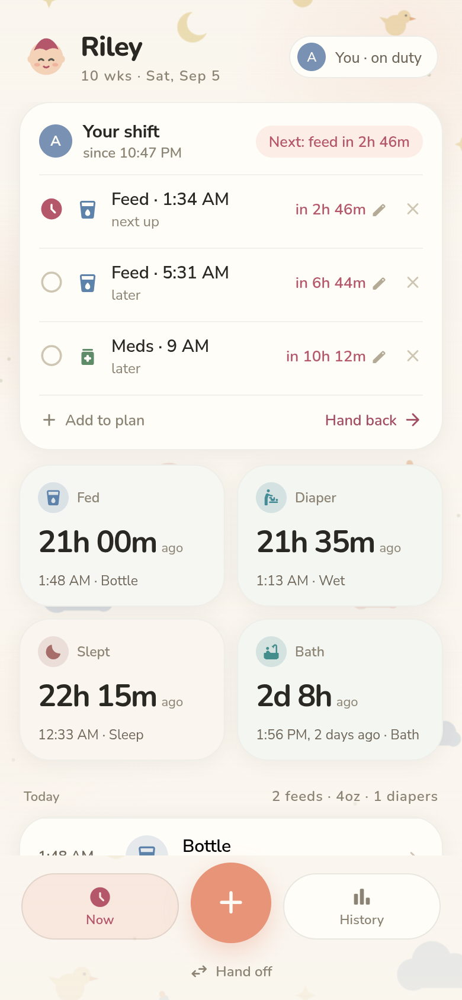
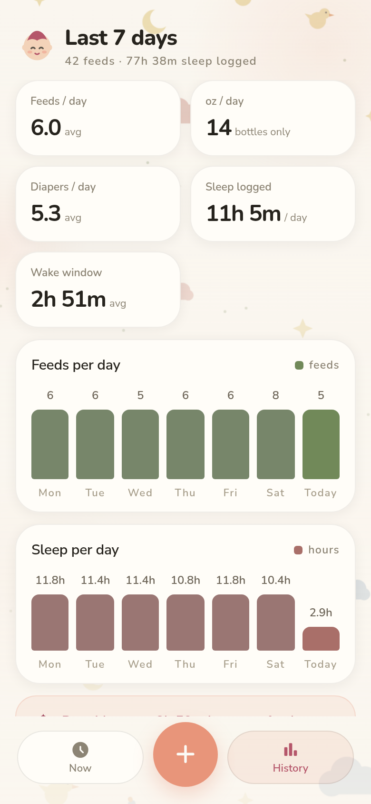
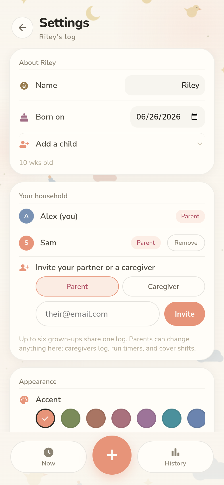
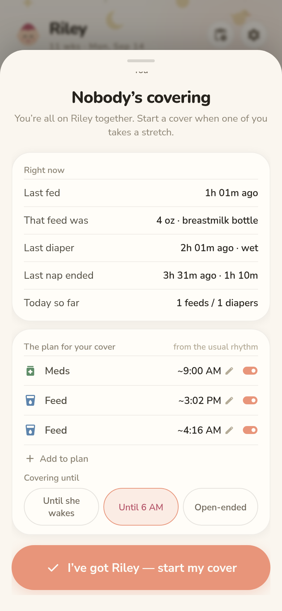
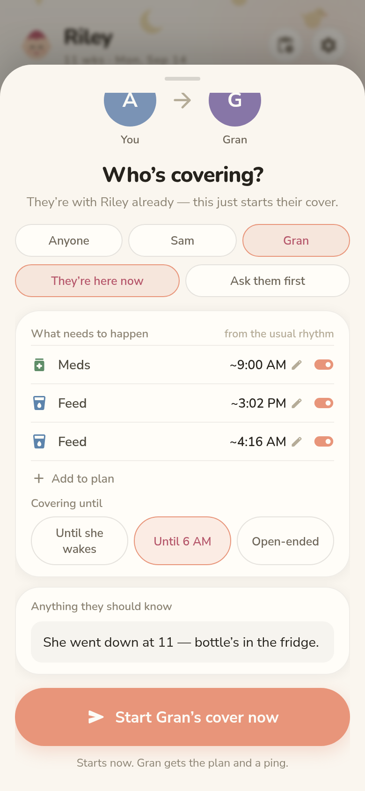
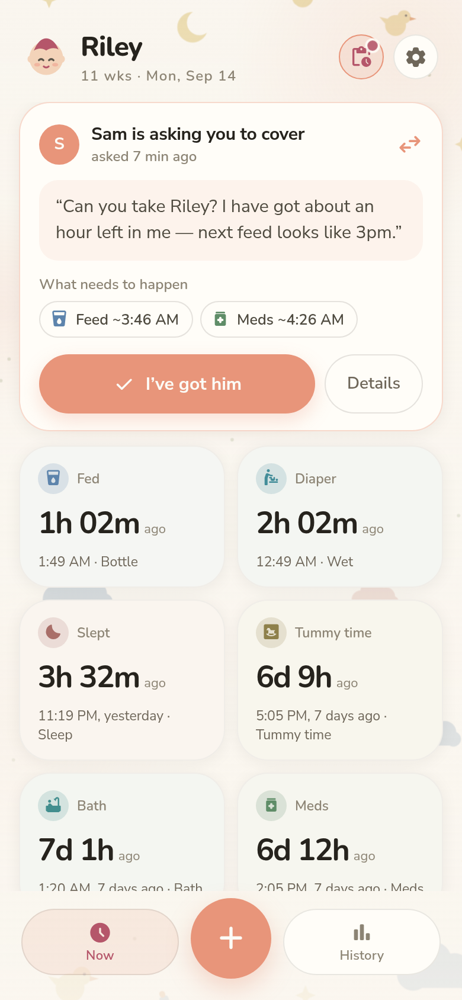

# mybabynotes 🐤

[](LICENSE)
[](https://github.com/straplocked/mybabynotes/actions/workflows/build-images.yml)

**Your baby's data on your own server.** mybabynotes is a self-hosted baby tracker built for one household sharing its babies' log — two parents, or parents plus the caregivers they trust — with true realtime sync between every phone, offline logging that works at 3am with no signal, shift handoffs as a first-class flow, and CSV export of everything. One container, one SQLite file, no cloud account, no telemetry, no subscription rug-pulls.

**Website: [mybabynotes.app](https://mybabynotes.app)**

<!-- screenshots:start -->
<p align="center">
  
  
  
</p>
<!-- screenshots:end -->

## What it does

- **Three taps from pocket to logged.** The entry sheet opens pre-stamped with the current time and a prediction of what you're about to log (alternating nursing sides, last bottle amount, feed-vs-diaper rhythm). Overriding the guess costs one tap; backfilling costs one nudge (−5/−15/−1h).
- **The whole household, one log — live.** Everyone joins by invite and sees the same log in realtime over websockets; with multiple children, pills on Now and History switch between each child's log. Entries write locally first and sync when there's signal, so 3am logging never waits on the network; queued entries are marked until they flush.
- **Shifts, not just a log.** "I need to sleep, take him" is a first-class flow. The person handing off *authors* the handoff — a plan drafted from the baby's rhythm whose items you can retime, drop, or add to (feed, nursing, pump, sleep, tummy time, bath, meds), an "until" time, a note, and (with three or more adults) a specific person to ask. It lands on the other phone as an actual plan rather than a sentence; they adjust it if they need to, accept, and duty moves. Logged feeds tick the plan off live, the off-duty parent watches progress on a read-only card without asking, a push pings both of you when the "until" passes, and handing back generates a shift summary instead of a "when did you…" conversation. Unfinished items — a dose that never happened — carry into the next shift's plan rather than evaporating with the handoff. Whoever already has the baby can also just start a shift, no ask required.

<p align="center">
  
  
  
</p>
- **Live timers, shared across phones.** Nursing, pumping, sleep, and tummy time run as server-backed start/stop timers visible on both devices; stopping a nursing, sleep, or tummy time timer auto-logs the entry, and stopping a pump timer opens the log sheet with the duration pre-filled so you can add the amount.
- **Now & History.** Since-cards the household picks from seven (fed, pumped, diaper, slept, tummy time, bath, meds), today's totals, an editable timeline with one-shot undo (add, edit, or delete) where every entry — a nap included — reads at the time it *started*, 7-day stats and charts with tap-through day-by-day drill-down, a feeds-rhythm insight, and a live age header from the baby's birth date.
- **Notifications without a cloud.** Self-hosted Web Push (VAPID keys generate themselves — no FCM/APNs account): handoff requests and handbacks, a partner starting a timer, opt-in partner activity, feed-gap and wake-window reminders, a daily meds nudge, and quiet hours — all per-parent.
- **Your data, portable.** Export the full log or per-day summaries as CSV through the native share sheet ("Share with your pediatrician"); switching from Baby Buddy? Settings imports its CSV exports, idempotently.
- **Made yours.** Household-shared accent and background themes, oz/ml units, a nameable daily med, toggleable entry types (pump, diapers, sleep, tummy time, bath, meds), account settings (name, email, password, baby's name), and per-device dark mode that can ignore the OS schedule for that 3am feed.
- **In your language.** The UI ships in the 15 most-spoken languages (English, Chinese, Hindi, Spanish, French, Arabic, Bengali, Portuguese, Russian, Urdu, Indonesian, German, Japanese, Marathi, Telugu), auto-detected from the browser and overridable per device — including right-to-left layout for Arabic and Urdu. The log itself stays canonical, so a household can mix languages and still share one history.
- **Invite-only by design.** The first account claims the instance and invites the rest of the household (emailed code with SMTP, shareable on-screen code without) — each invite as a **parent** (full control) or a **caregiver** (logs, timers, and shifts, but can't touch settings or membership). Password reset works the same way. Up to six adults and ten children per household — enough for a doula and twins, still an appliance, not a platform.

## Honest comparison: Baby Buddy

[Baby Buddy](https://github.com/babybuddy/babybuddy) is the established self-hosted baby tracker, and if you need breadth it's the mature choice. mybabynotes exists because of two gaps its own tracker has carried for years: no offline/PWA support and no realtime sync between caregivers' phones.

| | mybabynotes | Baby Buddy |
|---|---|---|
| Offline logging | Local-first PWA — entries queue and sync later | Needs a connection |
| Realtime partner sync | Live over websockets, both phones converge instantly | Refresh to see the other phone's entries |
| Shift handoffs | First-class: request → plan → handback summary | — |
| Household model | Up to 6 adults (parent/caregiver roles), up to 10 children | Many caregivers, multiple children |
| Tracking breadth | 10 focused entry types | Broader: growth + WHO percentiles, temperature, notes, more |
| Integrations | Versioned REST API + OpenAPI spec, Home Assistant (MQTT devices + ingress add-on), built-in MCP server, CSV export; imports Baby Buddy CSV | REST API, Home Assistant, companion mobile apps, MCP (separate container) |
| Languages | 15, English first-party and the rest machine-translated | 9 years of community i18n |
| License | AGPL-3.0 | BSD-2-Clause |

If you want growth charts, WHO percentiles, or translations vetted by native speakers, run Baby Buddy — it's good software with nearly a decade of work behind it. mybabynotes optimizes for a narrower job: exhausted adults logging offline at 3am, seeing each other's entries instantly, and handing the baby off without a status interview. If that's your job, and you're switching, Settings → Import will read the CSV files Baby Buddy exports.

## Integrations

Three surfaces, all writing through the same server-side path as the app — an integration's entry syncs to every phone instantly and obeys the same rules:

- **REST API** ([docs/integrations.md](docs/integrations.md)) — a stable, versioned `/api/v1` with scoped personal access tokens (created in Settings → API access) and a committed, CI-enforced OpenAPI spec ([docs/openapi.v1.json](docs/openapi.v1.json)) to point a client generator at.
- **Home Assistant** ([docs/home-assistant.md](docs/home-assistant.md)) — the household appears as HA devices via MQTT discovery (last-feeding/diaper/sleep sensors, quick-log and timer buttons), and an add-on puts the app itself in the HA sidebar via ingress — either running MyBabyNotes on the HA box or embedding an instance you already run elsewhere.
- **MCP** ([docs/mcp.md](docs/mcp.md)) — an MCP server built into the API at `/mcp` (no extra container): Claude and other AI clients can answer "how did last night go?", log entries, and run timers, gated by the same token scopes.

## Install

### 1. Unraid (Community Apps)

mybabynotes ships an all-in-one image (`ghcr.io/straplocked/mybabynotes-aio`) — one container serving the app, API, and websockets on a single port, with all state (SQLite + self-generated secrets) in one `/data` share. The CA template is [deploy/unraid/ca-template.xml](deploy/unraid/ca-template.xml); the **CA listing is pending submission**, and the AIO image publishes with the first tagged release — until both exist, use option 3 to build from source. Once the image is up you can install the template manually: copy the template to `/boot/config/plugins/dockerMan/templates-user/` on your flash share, then Docker tab → Add Container → pick it from the Template dropdown.

First boot generates every secret into `/data/.env` — nothing to configure on the LAN. Back up the one appdata folder and you've backed up the app. Pin a version by changing the repository tag from `:latest` to `:v1.0.0`.

### 2. Unraid (script install)

For a compose-based install (separate app/api/reverb containers), one command installs *and* updates — requires the *Docker Compose Manager* plugin:

```bash
curl -fsSL https://raw.githubusercontent.com/straplocked/mybabynotes/main/deploy/unraid/babylog.sh | sh
```

The script resolves the latest tagged release and verifies its tarball against the published `checksums.txt` (until the first release exists it falls back to an **unverified** `main` tarball), then rebuilds; data survives in `appdata/baby-log/data`. Pin or roll back with `BABYLOG_REF`:

```bash
curl -fsSL https://raw.githubusercontent.com/straplocked/mybabynotes/main/deploy/unraid/babylog.sh | BABYLOG_REF=v1.0.0 sh
```

### 3. Docker Compose (any server)

```bash
git clone https://github.com/straplocked/mybabynotes && cd mybabynotes
cp .env.example .env    # fill in APP_KEY + REVERB_APP_SECRET (generation commands in the file)
docker compose up -d --build    # http://localhost:3500
```

### 4. Home Assistant add-on

Runs MyBabyNotes on a Home Assistant OS box, in the HA sidebar via ingress, with its data riding HA's own backups — or, in remote mode, embeds an instance you already run elsewhere. Add the repository under Settings → Add-ons → Add-on Store → Repositories:

```
https://github.com/straplocked/mybabynotes-hassio-addons
```

then install **MyBabyNotes** from the store. Details (modes, MQTT sensors, phones/PWA): [docs/home-assistant.md](docs/home-assistant.md).

### 5. Local development

Same as above — the root compose file is the full stack. The API test suite runs in a container (no host PHP needed):

```bash
docker run --rm -v "$PWD/api:/app" -w /app -e BROADCAST_CONNECTION=log composer:2 php artisan test
```

**Remote access (all installs):** on the LAN, plain HTTP works. For phones outside the LAN — and for the PWA install prompt and push notifications, which require HTTPS — put a reverse proxy with **websocket support** in front (Nginx Proxy Manager, SWAG, Caddy; enable websockets for the `/app` path) and set `APP_URL` to your public origin (e.g. `https://notes.example.com`). Email (invite codes, password reset) is optional: configure SMTP via `MAIL_*` variables, or skip it and share invite codes from the screen.

## Stack

React 18 + Vite PWA · Laravel 13 API (SQLite, Sanctum) · Laravel Reverb websockets · nginx · Docker. Invite-only registration, throttled auth, client-generated entry ids with tombstone-synced deletes, poke-to-pull realtime (the server broadcasts "something changed", never data), computed shift reports, expiring tokens. Details: [docs/architecture.md](docs/architecture.md).

Releases are tagged: a `v*` tag runs the test suite, publishes `ghcr.io/straplocked/mybabynotes-app`, `mybabynotes-api`, and `mybabynotes-aio` images (`:vX.Y.Z` + `:latest`), and attaches a checksummed source tarball to the GitHub Release.

## Documentation

| Doc | What's in it |
|---|---|
| [docs/architecture.md](docs/architecture.md) | System design, sync model, realtime, notifications, shift semantics, key decisions |
| [docs/integrations.md](docs/integrations.md) | The public REST API (`/api/v1`): tokens, scopes, endpoints, entry semantics |
| [docs/openapi.v1.json](docs/openapi.v1.json) | Machine-readable OpenAPI spec for `/api/v1`, generated from the code and CI-enforced |
| [docs/home-assistant.md](docs/home-assistant.md) | MQTT entities + automations, and the ingress add-on (local/remote modes) |
| [docs/mcp.md](docs/mcp.md) | The built-in MCP server: auth, client setup, tool reference |
| [docs/api.md](docs/api.md) | The internal PWA/sync API — every endpoint with payloads, rules, and error behavior |
| [docs/operations.md](docs/operations.md) | Unraid runbook: update, reset, backups, reverse proxy, local dev, troubleshooting |
| [docs/ca-submission.md](docs/ca-submission.md) | Community Apps submission checklist + support-thread draft |
| [docs/known-limitations.md](docs/known-limitations.md) | Honest gaps + candidate roadmap |
| [docs/feeding-patterns.md](docs/feeding-patterns.md) | Sourced age-typical feeding/sleep norms behind the app's insights (not medical advice) |
| [TESTING.md](TESTING.md) | Trial-period journal — the feedback that drives iteration |
| [CLAUDE.md](CLAUDE.md) | Conventions for AI-assisted development sessions |

## Contributing

Bug reports, docs fixes, and PRs are welcome — see [CONTRIBUTING.md](CONTRIBUTING.md) for setup, project invariants, and the test commands. Contributions require a one-time [CLA signature](CLA.md) (a bot handles it on your first PR); the why is explained openly in the contributing guide. Security issues go through [private reporting](SECURITY.md), never public issues, and the community follows the [Contributor Covenant](CODE_OF_CONDUCT.md).

## License

mybabynotes' code is licensed under the [GNU Affero General Public License v3.0](LICENSE) (AGPL-3.0). Copyright © 2026 Chris Carvache. First-party source files carry `SPDX-License-Identifier: AGPL-3.0-only`; Laravel's untouched skeleton files stay under its MIT terms and carry no header.

You can self-host it, modify it, and redistribute it under the AGPL's terms. The **mybabynotes name** and any **hosted mybabynotes service** are not covered by the code license — if you distribute a modified version or run a public instance, please make clear it's your build, not the official project.

Because the AGPL covers software used over a network, every instance offers its own source: **Settings → Source code** links to this repository. If you deploy a **modified** build, point that link at your source — build with `VITE_SOURCE_URL=https://your.host/your-fork npm run build` (or set the same variable in the image build) rather than shipping a link to code you aren't running.

**Third-party components** keep their own licenses: React (MIT), Laravel and Reverb (MIT), Laravel Sanctum/MCP (MIT), `minishlink/web-push` (MIT), `php-mqtt/client` (MIT) — full dependency lists in [package.json](package.json) and [api/composer.json](api/composer.json). The UI loads two Google-hosted webfonts at runtime: [Nunito / Nunito Sans](https://fonts.google.com/specimen/Nunito) (SIL Open Font License 1.1) and [Material Symbols](https://github.com/google/material-design-icons) (Apache License 2.0).

An official hosted edition (this codebase plus closed-source billing/tenancy components) is planned; the [CLA](CLA.md) is what lets community contributions ship in both editions. The open-source app is and stays fully functional on its own — nothing here is feature-gated.
